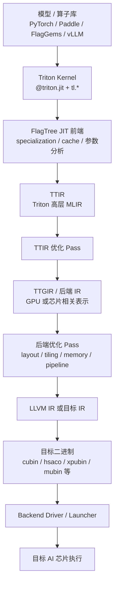

# FlagTree 第一次技术分享简版

这份文档用于第一次分享，重点回答五个问题：

- FlagOS 是什么？
- FlagTree 在 FlagOS 里负责什么？
- Triton kernel 如何经过 FlagTree lowering 到后端？
- 当前支持哪些模型工作负载和硬件后端？
- 如何 build，如何运行一个模型或算子？

## 1. FlagOS 是什么

FlagOS 是面向多元 AI 芯片的开源统一系统软件栈，目标是打通 **模型、系统、芯片** 三层。

它要解决的问题是：不同 AI 芯片通常有不同的软件栈、编译器、runtime 和工具链，上层模型迁移成本高。FlagOS 希望提供统一接口和工具链，让 PyTorch、Paddle、FlagGems、vLLM 等上层生态可以更低成本地运行在不同 AI 芯片上。

一句话理解：

> FlagOS 是一个面向多芯片的 AI 系统软件栈，目标是让上层模型和算子可以“一次开发，多芯运行”。

## 2. FlagTree 是什么

FlagTree 是 FlagOS 里的统一编译器项目，基于 Triton 扩展。

它的核心定位是：

> 把 Triton kernel 编译、优化并 lowering 到不同 AI 芯片后端。

对上层用户来说，FlagTree 尽量保持 Triton 的使用方式：

```python
import triton
import triton.language as tl

@triton.jit
def kernel(...):
    ...
```

对系统和芯片厂商来说，FlagTree 提供一个统一编译框架：

- 上层仍然使用 Triton 风格描述算子。
- 中间用 MLIR 表示算子和优化过程。
- 后端通过各自的 compiler、driver 和 lowering 逻辑接入硬件。

## 3. FlagTree 抽象了什么

FlagTree 不是模型框架，也不是单纯的算子库。它抽象的是：

> 从 Triton 算子源码到目标芯片可执行 kernel 的完整编译和运行过程。

可以按层理解：

| 层级 | FlagTree 抽象的内容 |
| --- | --- |
| 上层入口 | PyTorch / Paddle / FlagGems / vLLM 中调用 Triton kernel |
| 编程接口 | `@triton.jit`、`triton.language as tl` |
| 中间表示 | TTIR、TTGIR 或后端自定义 IR |
| 优化流程 | pass pipeline、layout、tiling、memory、pipeline 等优化 |
| 后端接入 | 不同芯片的 compiler、driver、launcher、二进制生成 |

## 4. 整体框架图



这张图可以作为第一次分享的主线：上层写 Triton kernel，FlagTree 负责把它逐层转换成目标芯片能执行的二进制。

## 5. 编译主流程

一次 Triton kernel 运行时，大致流程如下：

```text
Python @triton.jit
  -> Python AST
  -> TTIR
  -> TTIR Pass
  -> TTGIR 或后端 IR
  -> 后端优化 Pass
  -> LLVM IR / 目标 IR
  -> 目标二进制
  -> Driver 加载并启动 kernel
```

几个关键入口：

| 模块 | 作用 |
| --- | --- |
| `python/triton/runtime/jit.py` | JIT 入口、参数 specialization、cache |
| `python/triton/compiler/code_generator.py` | Python AST 生成 TTIR |
| `python/triton/compiler/compiler.py` | 统一编译调度 |
| `third_party/<backend>/backend/compiler.py` | 后端编译流程 |
| `third_party/<backend>/backend/driver.py` | 后端运行时加载和启动 |

不同后端的下沉路径不同，例如：

```text
NVIDIA:   TTIR -> TTGIR -> LLVM IR -> PTX -> cubin
AMD:      TTIR -> TTGIR -> LLVM IR -> AMDGCN -> hsaco
XPU:      TTIR -> TTXIR/TTSDNN -> LLVM IR -> ELF -> xpubin
MThreads: TTIR -> TTGIR -> LLVM IR -> mubin
```

整体思路是：**前端尽量统一，后端按芯片实现差异化 lowering 和 runtime**。

## 6. 当前支持的后端

FlagTree 用不同分支支持不同 Triton 版本和后端。README 中列出的主要情况如下：

| 分支 | Triton 版本 | 后端 |
| --- | --- | --- |
| `main` | 3.0 / 3.1 | NVIDIA、AMD、x86_64 CPU、ILUVATAR、MThreads、KLX/XPU、MetaX、HCU |
| `triton_v3.2.x` | 3.2 | NVIDIA、AMD、Ascend、MThreads、Cambricon |
| `triton_v3.3.x` | 3.3 | NVIDIA、AMD、x86_64 CPU、AIPU、Tsingmicro、Enflame、ARM64 CPU |
| `triton_v3.4.x` | 3.4 | NVIDIA、AMD、Sunrise |
| `triton_v3.5.x` | 3.5 | NVIDIA、AMD、Enflame、Ascend |
| `triton_v3.6.x` | 3.6 | NVIDIA、AMD、Enflame、HCU、MThreads、Damo Academy、RPU |

当前 `main` 分支中能看到的主要后端目录包括：

```text
third_party/nvidia
third_party/amd
third_party/xpu
third_party/mthreads
third_party/iluvatar
third_party/metax
third_party/hcu
third_party/triton_shared
```

## 7. 当前模型和工作负载支持

这里要先明确边界：FlagTree 仓库本身不是模型仓库，它主要支持模型中的 Triton 算子编译和运行。

从当前文档和测试可以看到，FlagTree 重点覆盖模型中常见的 kernel 工作负载：

- 矩阵乘：matmul / bmm / GEMM。
- 注意力：flash attention、paged attention、decoder attention。
- LLM 常用算子：rotary embedding、cache reshape/update。
- 训练或推理常见算子：cross entropy、elementwise、reduction 等。

README 里用 **Qwen 模型中调用的 mm 算子 shape** 展示了在不同芯片上的性能收益。发布记录中也提到与 FlagGems 算子库、Paddle 框架等上层生态的适配。

第一次分享可以这样概括：

> FlagTree 不是直接维护完整模型，而是让模型里的 Triton kernel 能够通过统一编译链路运行到多种 AI 芯片上。当前可重点用 Qwen mm shape、attention、LLM cache 类算子作为例子介绍。

## 8. 如何 build

第一次上手建议优先使用官方镜像，因为 FlagTree 对 LLVM、Python、PyTorch、芯片 SDK、driver/runtime 版本比较敏感。

常见安装文档：

| 后端 | 文档 |
| --- | --- |
| NVIDIA / AMD | `documents/install_cn.md` |
| XPU | `documents/install_xpu_cn.md` |
| MThreads | `documents/install_mthreads_cn.md` |
| HCU | `documents/install_hcu_cn.md` |
| Ascend | `documents/install_ascend_cn.md` |
| Enflame | `documents/install_enflame_cn.md` |
| MetaX | `documents/install_metax_cn.md` |

源码构建的基本形式：

```shell
cd FlagTree
python3 -m pip install -r python/requirements.txt

cd python
# NVIDIA / AMD 不需要设置 FLAGTREE_BACKEND
unset FLAGTREE_BACKEND
MAX_JOBS=32 python3 -m pip install . --no-build-isolation -v
```

构建单个第三方后端时，通常设置 `FLAGTREE_BACKEND`：

```shell
cd FlagTree/python
export FLAGTREE_BACKEND=xpu        # 或 mthreads / hcu / ascend / enflame 等
MAX_JOBS=32 python3 -m pip install . --no-build-isolation -v
```

安装后确认：

```shell
python3 -m pip show flagtree
python3 -c 'import triton; print(triton.__path__)'
```

## 9. 如何编译和运行模型

FlagTree 的使用方式和 Triton 基本一致。安装 FlagTree 后，`import triton` 会使用 FlagTree 提供的 Triton 包。

运行时逻辑可以简单理解为：

1. 模型或算子库调用 Triton kernel。
2. 第一次执行时触发 FlagTree JIT 编译。
3. 编译产物进入 cache。
4. driver 加载目标二进制并启动 kernel。
5. 后续相同 specialization 命中 cache，避免重复编译。

运行模型时，一般不需要改模型主流程：

```shell
# 进入对应后端环境或镜像
python3 -m pip show flagtree

# 按原框架方式运行模型脚本
python run_model.py
```

如果想确认 kernel 是否经过 FlagTree 编译，可以打开 dump：

```shell
export TRITON_KERNEL_DUMP=1
export TRITON_ALWAYS_COMPILE=1
```

`TRITON_KERNEL_DUMP=1` 会 dump TTIR、TTGIR、LLVM IR、目标代码等中间产物，适合第一次调试和讲解编译链路。

## 10. 第一次分享建议

第一次分享建议只讲清楚主线，不展开 pass 和算子开发细节：

1. FlagOS：面向多芯片的统一 AI 系统软件栈。
2. FlagTree：FlagOS 里的 Triton 多后端编译器。
3. 抽象能力：把 Triton kernel lowering 到不同芯片。
4. 主流程：`@triton.jit -> TTIR -> TTGIR/后端 IR -> LLVM/目标 IR -> 二进制 -> driver 运行`。
5. 支持范围：多个芯片后端，模型侧主要承接 Triton 算子工作负载。
6. 上手方式：优先用镜像；源码构建通过 `FLAGTREE_BACKEND` 选择后端；模型按原框架脚本运行。

后续可以单独开专题讲：

- 如何新增 `tl.*` 算子或扩展语义。
- 如何写 MLIR pass。
- 如何接入一个新后端。
- 如何分析 dump 出来的 TTIR、TTGIR 和 LLVM IR。
