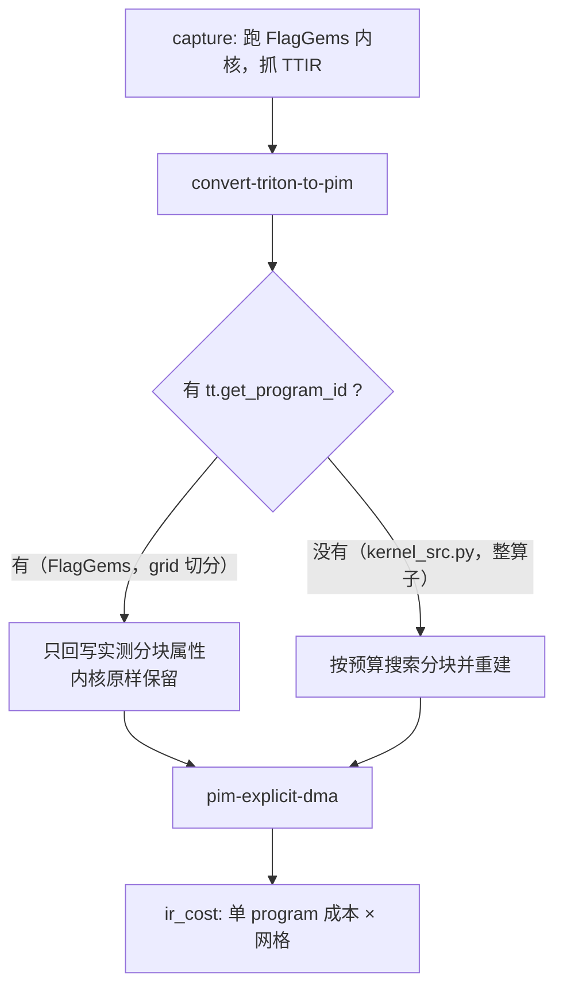

# pim-tile-to-budget 遇到 grid 切分内核（FlagGems linear）2026-10-02

## 1. 问题现象

GeneSim 成本桥接（A 路）跑 llama2-7b 时，`pim-tile-to-budget` 直接失败：

```
flag_gems/ops/linear.py:97:33: error: pim-tile-to-budget rewrite expects
    a tt.trans directly feeding tt.dot's b operand
RuntimeError: PassManager::run failed
```

触发的形状是 FFN 的两个投影（`Tq x 11008`、`Tq x 4096`）：可见分块
128x128x32 占 81920 字节，超过 65536 字节的 WRAM 预算，于是走进改写分支。

## 2. 根因

改写器的前提是**整算子内核**——它按 `kernel_src.py::linear_kernel` 的算子
序列重建整个 kernel，注释里写明「Mirrors `kernel_src.py` 的 op sequence
one-for-one」。而 FlagGems 的 autotune 内核是 **launch grid 切分**的：
一个 program 只算一块 (M,N)，循环不覆盖整算子，权重加载时也不经过
`tt.trans`。两者的差异：

| 维度 | `kernel_src.py`（图编译器侧） | `flag_gems.ops.linear`（A 路） |
|------|------------------------------|------------------------------|
| 覆盖范围 | 一个 program 覆盖整算子 | 一个 program 只算一块（2 维 grid） |
| 权重加载 | 按行加载成 `[N, K]`，再 `tt.trans` | 加载时就按 K 主序取 `[K, N]`，无 `tt.trans` |
| 指针来源 | 循环内现算 `splat + addptr` | 循环外算好，作 `scf.for` 的 iter_arg 传入 |
| 落盘前 | `tt.dot` → `arith.truncf` → `tt.store` | 多一层 `acc + broadcast(bias)` |

pass 的形状推断早就为 FlagGems 内核留了 `full-m/n/k` 覆盖（见
`inferFullShape` 的注释），但那只是让**形状/占用**算得出来，并没有让重建
成立——重建出来的是「一个 program 算完整张输出」，而启动网格不变，语义就
变了。

**为什么现在才坏**：工作区里未提交的 `accumBytes` 改动把累加器按 f32 的
4 字节计费，同一分块从 49152 涨到 81920 字节，于是这批 kernel 从「放得进、
不改写」翻成「要改写」。产物文件停在 09-29，与这个时间线吻合。

## 3. 改动内容

### 3.1 不改写 grid 切分的内核

文件：`lib/Dialect/TritonPIM/Transforms/TileToBudget.cpp`

新增 `isGridPartitioned()`：模块里存在 `tt.get_program_id` 就是 grid 切分
内核（图编译器侧的内核不读 program id）。这类内核只按实测分块回写属性，
**不重建**：

```cpp
bool needsRewrite =
    !gridPartitioned && !fitsBudget(tile, *bytes, accum, *wram, *dma);
```

超预算这件事由属性如实体现：此时 `pim.tile-wram-bytes` 会大于
`pim.wram-bytes`，让超支可见而不是被一次改写掩盖。

### 3.2 位置参数也要能折出循环次数

文件（图编译器仓）：`genesim_bridge/ir_cost.py`

`_ConstFolder` 原来只用 `arg_values` 的**形参名**做种子（存成 `%K`），但真实
捕获的 TTIR 里 Triton 不保留形参名，参数是 `%arg6` 这种位置名，于是
`divsi(addi(%arg6,31),32)` 这条链永远折不出来，K 循环被按 1 次计，GEMM 成本
低估约 126 倍（实测 9.16e7，真值 1.15e10）。

新增 `_bind_signature()`：数一遍签名里哪些参数是指针、哪些是标量，标量的
按顺序取 `arg_values` 的前若干个（指针实参是张量，采集时已被过滤）。这是
`arg_values` 本来就承诺的用途（「标量实参，供 ir_cost 求循环次数」），此前
只是名字对不上。

## 4. 处理流程



## 5. 已实施的测试

| 测试 | 结果 |
|------|------|
| `lit test/Dialect/TritonPIM`（44 个用例，含新增 1 个） | 44/44 通过 |
| 新增用例 `tile_to_budget_grid_partitioned.mlir` 的变异对照 | 转红，确认检查真的生效 |
| `genesim_bridge` 新增 `test_positional_kernel_args_resolve_loop_bounds` | 先红（`[None] != [2]`）后绿 |
| 编译器仓 `pytest -k "not llama2_7b"` | 1218 通过 |

新增 lit 用例固定两件事：超预算但被 grid 切分时**不出现** `tt.trans`（没重建），
且 `pim.tile-*` 回写的是实测分块（8x8x4）而不是搜索出来的更小块。

## 6. 当前存在的不足

1. **grid 内核的 pimir 会如实超预算**。`pim.tile-wram-bytes` 可能大于
   `pim.wram-bytes`，这是「这个 kernel 的实测分块放不进 WRAM」的事实，不是
   错误；但它意味着 A 路的成本描述的是**未改写**的执行，与 PIM 上真正会跑的
   分块执行不同。要做后者得走 B 路（整算子级）。
2. **判据是「有没有 program id」，不是「program id 是否被用到」**。改写后的
   模块里会残留死掉的 `tt.get_program_id`，但那个模块不会再进这个判断
   （判断发生在重建之前），所以不影响。若将来前端产出带死 program id 的内核，
   会被误判成 grid 切分——届时改成判「是否被 dot 的操作数链用到」。
3. **`_bind_signature` 假定 `arg_values` 里标量实参的顺序与签名一致**。它成立
   是因为采集时是 `dict(zip(arg_names, args))`——flag_gems 把尺寸/步长**全部按
   位置**传，所以顺序就是签名顺序。若将来有调用方改用关键字传参且顺序与签名
   不同，位置会对错，这时会**折出错误的值**（不是折不出来），成本静默错误。
   真要兜住得在采集侧连参数名一起带上，不在本函数能判的范围里。
4. **A 路产物走不通 EmitC**：`pim-lower-to-emitc` 只接受指针参数，而
   FlagGems 内核带 i32 标量参数（M/N/K/stride）。A 路只跑到
   `pim-explicit-dma` 为止，不受影响。
