# TritonPIM 当前实现技术文档

本文档根据当前工作区代码改动整理，目的是帮助快速理解这次在 FlagTree/Triton 中新增的 PIM 相关实现：它做什么、怎么接入、各文件改了什么、关键函数逻辑是什么，以及当前还存在什么问题。

## 1. 一句话概述

当前实现给 Triton 增加了一条 PIM 中间表示支路：从 TTIR 分叉生成 TritonPIM IR，用 `#pim.tasklet_tiled` 描述 tasklet 上的数据布局，用 `!pim.memdesc` 描述 DPU 本地内存缓冲区，并把原本隐式的 `tt.load`、`tt.store` 改写成显式的 WRAM 分配、DMA 传输、barrier 同步和 WRAM 读写。

它当前更像是一个 PIM IR 原型和分析支路，不是完整可执行的 PIM 后端。也就是说，它能把 Triton 的中间表示降到 PIM 风格的 IR，并能导出 `.pimir` 文件，但还没有继续降到真实 PIM 设备可执行代码。

## 2. 这套代码解决什么问题

传统 GPU 路径里，Triton 会把 TTIR 继续降到 TTGIR，再降到 LLVM、PTX、CUBIN。GPU 有线程、warp、共享内存、缓存等执行模型。

PIM 设备的执行模型不同：


| 概念         | GPU 路径                              | 当前 PIM 路径              |
| ------------ | ------------------------------------- | -------------------------- |
| 执行单元     | thread、warp、CTA                     | DPU、tasklet               |
| 本地快速内存 | shared memory                         | WRAM                       |
| 大容量内存   | global memory                         | MRAM                       |
| 内存访问     | `tt.load`/`tt.store` 仍像隐式全局访问 | 显式`dma_load`/`dma_store` |
| 同步         | GPU barrier、warp 原语                | `pim.barrier`              |
| 张量布局     | `#ttg.blocked` 等 GPU 布局            | `#pim.tasklet_tiled`       |
| 当前输出     | GPU 二进制                            | PIM 风格 MLIR 文本         |

因此这次实现的核心思路是：计算算子尽量保留，内存与布局换成 PIM 模型。

## 3. 总体架构

### 3.1 主流程

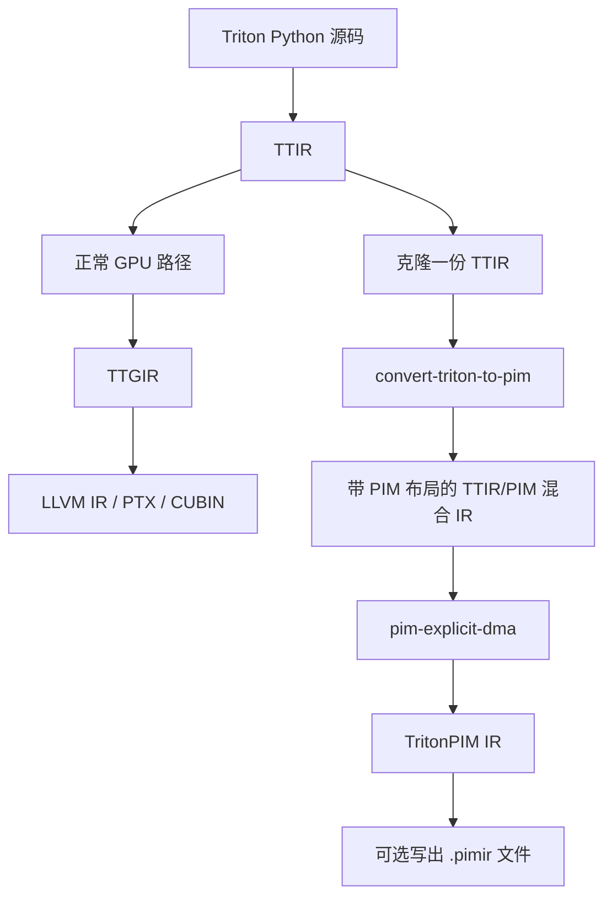

关键点：


| 步骤                    | 作用                                              |
| ----------------------- | ------------------------------------------------- |
| 克隆 TTIR               | 不影响原 GPU 编译流程                             |
| `convert-triton-to-pim` | 给张量加 PIM 布局，记录 PIM 硬件参数              |
| `pim-explicit-dma`      | 把`tt.load`、`tt.store` 改成显式 DMA 和 WRAM 操作 |
| `.pimir` 输出           | 用于查看、调试、后续成本模型或 PIM 后端           |

### 3.2 和 GPU 路径的关系

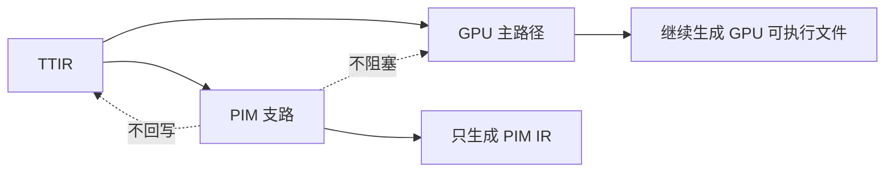

当前实现里，PIM 是旁路输出。正常 GPU 编译仍然继续走原来的线性 stage，PIM 只在启用环境变量时从 TTIR 旁路生成。

## 4. 当前 git 状态中的改动分类

### 4.1 已跟踪文件的修改


| 文件                                       | 改动摘要                                                                          |
| ------------------------------------------ | --------------------------------------------------------------------------------- |
| `bin/RegisterTritonDialects.h`             | 注册 TritonPIM 方言、`convert-triton-to-pim` pass、`pim-explicit-dma` pass        |
| `include/triton/Conversion/CMakeLists.txt` | 增加`TritonToTritonPIM` 头文件构建目录                                            |
| `include/triton/Dialect/CMakeLists.txt`    | 增加`TritonPIM` 方言头文件构建目录                                                |
| `lib/Conversion/CMakeLists.txt`            | 增加`TritonToTritonPIM` 转换库构建目录                                            |
| `lib/Dialect/CMakeLists.txt`               | 增加`TritonPIM` 方言实现库构建目录                                                |
| `python/src/ir.cc`                         | Python 侧加载 TritonPIM 方言；给`ModuleOp` 增加 `clone()` 绑定                    |
| `python/src/passes.cc`                     | Python 侧暴露`passes.pim.add_convert_to_pim()` 和 `passes.pim.add_explicit_dma()` |
| `third_party/nvidia/backend/compiler.py`   | 在 NVIDIA 后端 TTIR 生成后，按需调用 PIM sidecar 输出 PIM IR                      |

### 4.2 新增源码目录


| 目录                                           | 作用                                                 |
| ---------------------------------------------- | ---------------------------------------------------- |
| `include/triton/Dialect/TritonPIM/`            | TritonPIM 方言、类型、属性、算子和 pass 声明         |
| `lib/Dialect/TritonPIM/`                       | TritonPIM 方言、类型、属性、算子和显式 DMA pass 实现 |
| `include/triton/Conversion/TritonToTritonPIM/` | TTIR 到 TritonPIM 的转换 pass 声明                   |
| `lib/Conversion/TritonToTritonPIM/`            | TTIR 到 TritonPIM 的转换 pass 实现                   |
| `test/Conversion/triton_to_pim.mlir`           | `convert-triton-to-pim` 转换测试                     |
| `test/Dialect/TritonPIM/ops.mlir`              | PIM 方言算子、类型、属性打印解析测试                 |
| `test/Dialect/TritonPIM/explicit_dma.mlir`     | 显式 DMA pass 测试                                   |

### 4.3 需要特别注意的未跟踪或忽略文件


| 文件或目录                                                            | 当前情况                                                                                | 建议                                                          |
| --------------------------------------------------------------------- | --------------------------------------------------------------------------------------- | ------------------------------------------------------------- |
| `python/triton/backends/pim_sidecar.py`                               | 文件存在，但被`.gitignore` 的 `python/triton/backends/*` 忽略，普通 `git status` 看不到 | 如果这是实现的一部分，需要调整`.gitignore` 或强制加入版本控制 |
| `python/flagtree.egg-info/`                                           | 当前显示为未跟踪，通常是 Python 打包生成物                                              | 一般不应提交                                                  |
| `2026-08-16-092127-local-command-caveatcaveat-the-messages-below.txt` | 未跟踪日志文件                                                                          | 一般不应提交，除非确认有用途                                  |

## 5. 新增方言：TritonPIM

### 5.1 方言定位

文件：`include/triton/Dialect/TritonPIM/IR/PIMDialect.td`

TritonPIM 方言名是 `pim`，命名空间是 `mlir::triton::pim`。

它位于 TTIR 下面、TTGIR 旁边：

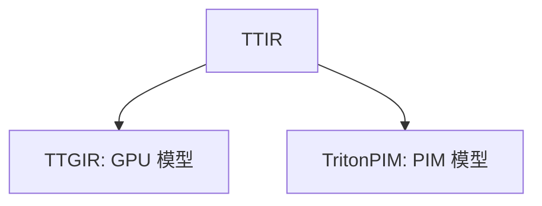

它主要补充三类信息：


| 类别               | 表达                                              |
| ------------------ | ------------------------------------------------- |
| tasklet 数据布局   | `#pim.tasklet_tiled`                              |
| DPU 本地内存描述   | `!pim.memdesc`                                    |
| 显式内存搬运和同步 | `pim.dma_load`、`pim.dma_store`、`pim.barrier` 等 |

### 5.2 模块属性

文件：`include/triton/Dialect/TritonPIM/IR/Dialect.h`


| 属性                  | 含义                         | 写入者                  |
| --------------------- | ---------------------------- | ----------------------- |
| `pim.num-dpus`        | 设备 DPU 数量                | `convert-triton-to-pim` |
| `pim.num-tasklets`    | 每个 DPU 的 tasklet 数量     | `convert-triton-to-pim` |
| `pim.wram-bytes`      | 每个 DPU 的 WRAM 预算        | `convert-triton-to-pim` |
| `pim.target`          | PIM 目标字符串，例如`pim:v1` | `convert-triton-to-pim` |
| `pim.wram-bytes-used` | 当前 kernel 的 WRAM 分配总量 | `pim-explicit-dma`      |

这些属性只能挂在 `module` 上。`TritonPIMDialect::verifyOperationAttribute()` 会拒绝把这些属性挂到普通算子上。

### 5.3 PIM 布局属性

文件：`include/triton/Dialect/TritonPIM/IR/PIMAttrDefs.td`
实现：`lib/Dialect/TritonPIM/IR/Dialect.cpp`

核心属性是：

```mlir
#pim.tasklet_tiled<{
  sizePerTasklet = [1, 1],
  taskletsPerDpu = [16, 1],
  dpusPerDevice = [1, 1],
  order = [1, 0]
}>
```

字段含义：


| 字段             | 含义                                   |
| ---------------- | -------------------------------------- |
| `sizePerTasklet` | 单个 tasklet 在每个维度负责多少元素    |
| `taskletsPerDpu` | 一个 DPU 内的 tasklet 如何铺到各个维度 |
| `dpusPerDevice`  | 设备上的 DPU 如何铺到各个维度          |
| `order`          | 维度访问顺序，最快变化维度在前         |

当前默认布局生成逻辑：

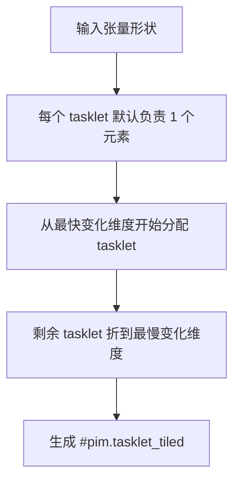

关键函数：


| 函数                                                 | 作用                                        |
| ---------------------------------------------------- | ------------------------------------------- |
| `TaskletTiledEncodingAttr::getTotalTaskletsPerDpu()` | 计算一个 DPU 内总 tasklet 数                |
| `TaskletTiledEncodingAttr::getTotalDpusPerDevice()`  | 计算总 DPU 数                               |
| `TaskletTiledEncodingAttr::getTotalSizePerTasklet()` | 计算单 tasklet 总元素数                     |
| `TaskletTiledEncodingAttr::parse()`                  | 自定义解析`#pim.tasklet_tiled`              |
| `TaskletTiledEncodingAttr::print()`                  | 自定义打印`#pim.tasklet_tiled`              |
| `TaskletTiledEncodingAttr::verify()`                 | 检查 rank、数组长度、正数、`order` 是否合法 |
| `getDefaultTaskletTiledEncoding()`                   | 根据形状、tasklet 数、DPU 数生成默认布局    |

### 5.4 PIM 内存类型

文件：`include/triton/Dialect/TritonPIM/IR/PIMTypes.td`
实现：`lib/Dialect/TritonPIM/IR/Types.cpp`

核心类型是：

```mlir
!pim.memdesc<64x32xf16, #pim.wram>
!pim.memdesc<1024xf32, #pim.mram>
```

它表示 DPU 本地某块内存里的缓冲区。


| 字段          | 含义                                    |
| ------------- | --------------------------------------- |
| shape         | 缓冲区形状                              |
| elementType   | 元素类型                                |
| memorySpace   | `#pim.wram` 或 `#pim.mram`              |
| mutableMemory | 是否可变，默认可变，可打印为`immutable` |

关键函数：


| 函数                            | 作用                                    |
| ------------------------------- | --------------------------------------- |
| `MemDescType::parse()`          | 解析`!pim.memdesc<...>`                 |
| `MemDescType::print()`          | 打印`!pim.memdesc<...>`                 |
| `MemDescType::verify()`         | 检查 shape 非空、维度为正、内存空间合法 |
| `MemDescType::isWRAM()`         | 判断是否 WRAM                           |
| `MemDescType::isMRAM()`         | 判断是否 MRAM                           |
| `MemDescType::getSizeInBytes()` | 静态计算缓冲区字节数                    |

## 6. 新增 PIM 算子

文件：`include/triton/Dialect/TritonPIM/IR/PIMOps.td`
实现：`lib/Dialect/TritonPIM/IR/Ops.cpp`

### 6.1 算子总览


| 算子                 | 作用                                    |
| -------------------- | --------------------------------------- |
| `pim.tasklet_id`     | 返回当前 tasklet 编号                   |
| `pim.dpu_id`         | 返回当前 DPU 编号                       |
| `pim.wram_alloc`     | 在 WRAM 中分配 staging buffer           |
| `pim.dma_load`       | 从 MRAM 指针张量搬运到 WRAM             |
| `pim.dma_store`      | 从 WRAM 搬运回 MRAM 指针张量            |
| `pim.wram_load`      | 从 WRAM buffer 读成张量值               |
| `pim.wram_store`     | 把张量值写入 WRAM buffer                |
| `pim.barrier`        | DPU 内 tasklet 同步                     |
| `pim.convert_layout` | 在不同`#pim.tasklet_tiled` 布局之间转换 |

### 6.2 内存访问模型


反向写回：


### 6.3 verifier 逻辑


| 算子                 | 检查逻辑                                                                                    |
| -------------------- | ------------------------------------------------------------------------------------------- |
| `pim.wram_alloc`     | 必须分配到`#pim.wram`；如果能静态算大小，会检查是否超过 `pim.wram-bytes`                    |
| `pim.dma_load`       | 指针必须是 pointer tensor；指针 shape 和 WRAM buffer shape 一致；元素类型一致；DMA 属性合法 |
| `pim.dma_store`      | 源 WRAM buffer 和目标 pointer tensor 的 shape、元素类型一致；DMA 属性合法                   |
| `pim.wram_load`      | 结果张量 shape、元素类型必须和 buffer 一致                                                  |
| `pim.wram_store`     | 输入张量 shape、元素类型必须和 buffer 一致                                                  |
| `pim.convert_layout` | 源和目标布局不能完全相同                                                                    |

## 7. 布局推导逻辑

实现：`lib/Dialect/TritonPIM/IR/Dialect.cpp` 中的 `TritonPIMInferLayoutInterface`

Triton 里一些 shape-changing 算子会询问方言如何推导结果布局。PIM 实现了这些推导规则。


| 算子             | PIM 布局推导策略                                                               |
| ---------------- | ------------------------------------------------------------------------------ |
| `tt.trans`       | 按转置顺序同步重排`sizePerTasklet`、`taskletsPerDpu`、`dpusPerDevice`、`order` |
| `tt.reduce`      | 删除 reduce 维度，把丢失的 tasklet 折到剩余最慢变化维度                        |
| `tt.expand_dims` | 插入大小为 1 的维度，新增维度使用 1 个元素、1 个 tasklet                       |
| `tt.dot`         | 不强制特殊布局，因为 PIM 没有 tensor core                                      |
| `tt.reshape`     | 生成目标形状默认布局，显式暴露可能的数据重排                                   |
| `tt.join`        | 追加大小为 2 的尾维度，并让它成为最快变化维度                                  |
| `tt.split`       | 要求最后一维能在单个 tasklet 内保存两个元素                                    |
| `tt.fp4_to_fp`   | 当前明确不支持                                                                 |

示意：

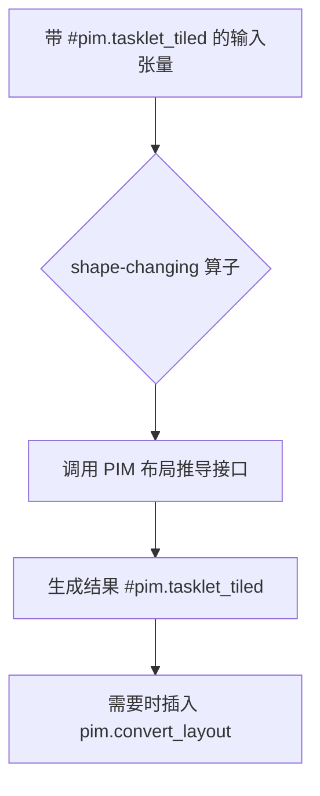

## 8. 转换 pass：convert-triton-to-pim

声明：`include/triton/Conversion/TritonToTritonPIM/Passes.td`
实现：`lib/Conversion/TritonToTritonPIM/TritonToTritonPIMPass.cpp`
辅助：`lib/Conversion/TritonToTritonPIM/TritonPIMConversion.cpp`

### 8.1 pass 选项


| 选项                  | 默认值   | 含义                            |
| --------------------- | -------- | ------------------------------- |
| `target`              | 空字符串 | 必填，PIM 目标名，例如`pim:v1`  |
| `num-dpus`            | `1`      | DPU 数量                        |
| `num-tasklets`        | `16`     | 每个 DPU tasklet 数             |
| `wram-bytes`          | `65536`  | 每个 DPU WRAM 预算              |
| `enable-source-remat` | `false`  | 是否启用 source materialization |

### 8.2 核心流程

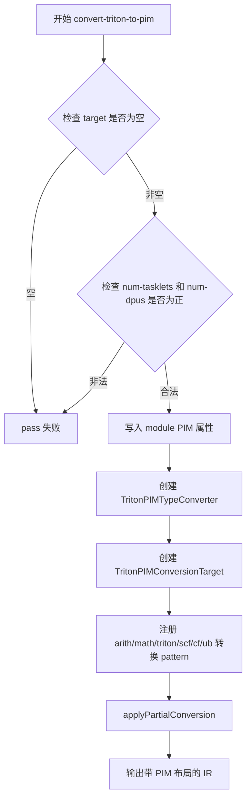

### 8.3 类型转换逻辑

类：`TritonPIMTypeConverter`


| 转换对象                           | 规则                                 |
| ---------------------------------- | ------------------------------------ |
| 普通类型                           | 原样保留                             |
| 没有 encoding 的`RankedTensorType` | 加上默认`#pim.tasklet_tiled`         |
| `tt.ptr<tensor<...>>`              | 给 pointee tensor 加 PIM 布局        |
| source materialization             | 可选插入`UnrealizedConversionCastOp` |
| target materialization             | 布局不匹配时插入`pim.convert_layout` |

### 8.4 转换目标合法性

类：`TritonPIMConversionTarget`

当前合法性规则：


| 规则                                                    | 含义                                |
| ------------------------------------------------------- | ----------------------------------- |
| TritonPIM 方言合法                                      | 新增 PIM 算子可以存在               |
| arith、math、Triton、scf、cf、ub 动态合法               | 只要类型已经转换到 PIM 布局即可     |
| `scf.execute_region`、`scf.parallel`、`scf.reduce` 非法 | PIM 目前没有对应硬件调度模型        |
| `tt.func` 动态合法                                      | 函数参数里的 tensor 必须带 encoding |

### 8.5 主要 pattern


| pattern 或函数                       | 作用                                                      |
| ------------------------------------ | --------------------------------------------------------- |
| `GenericOpPattern`                   | 重建算子，替换成转换后的类型和操作数                      |
| `ArithConstantPattern`               | 常量 tensor reshape 到带 PIM encoding 的类型              |
| `populateArithPatternsAndLegality()` | 注册整数、浮点、比较、cast、select 等 arith 转换          |
| `populateMathPatternsAndLegality()`  | 注册 exp、sqrt、sin、cos、fma 等 math 转换                |
| `TritonBroadcastPattern`             | broadcast 保留源布局，只扩展 shape                        |
| `TritonExpandDimsPattern`            | 重建`tt.expand_dims`，布局由方言接口推导                  |
| `TritonTransPattern`                 | 重建`tt.trans`，布局由方言接口推导                        |
| `TritonDotPattern`                   | 保留`tt.dot`，结果布局来自 accumulator                    |
| `TritonSplitOpPattern`               | 必要时先插入`pim.convert_layout`，保证 split 最后一维可拆 |
| `TritonReducePattern`                | 重建`tt.reduce` 并复制 combine region                     |
| `TritonScanPattern`                  | 重建`tt.scan` 并复制 combine region                       |
| `TritonFuncOpPattern`                | 转换函数签名和 region 参数类型                            |
| `SCFForPattern`                      | 转换`scf.for` 结果和 region 类型                          |
| `SCFIfPattern`                       | 转换`scf.if` 结果和两个 region                            |
| `SCFWhilePattern`                    | 转换`scf.while` 两个 region                               |
| `CFBranchPattern`                    | 转换普通分支参数                                          |
| `CFCondBranchPattern`                | 转换条件分支参数                                          |

重要设计点：`tt.load` 和 `tt.store` 在这个 pass 里不会被替换，只是它们的操作数和结果类型带上 PIM 布局。真正改写内存访问的是下一个 pass。

## 9. 转换 pass：pim-explicit-dma

声明：`include/triton/Dialect/TritonPIM/Transforms/Passes.td`
实现：`lib/Dialect/TritonPIM/Transforms/ExplicitDMA.cpp`

### 9.1 pass 目标

把 TTIR 中隐式的全局内存访问改写成 PIM 显式数据搬运。

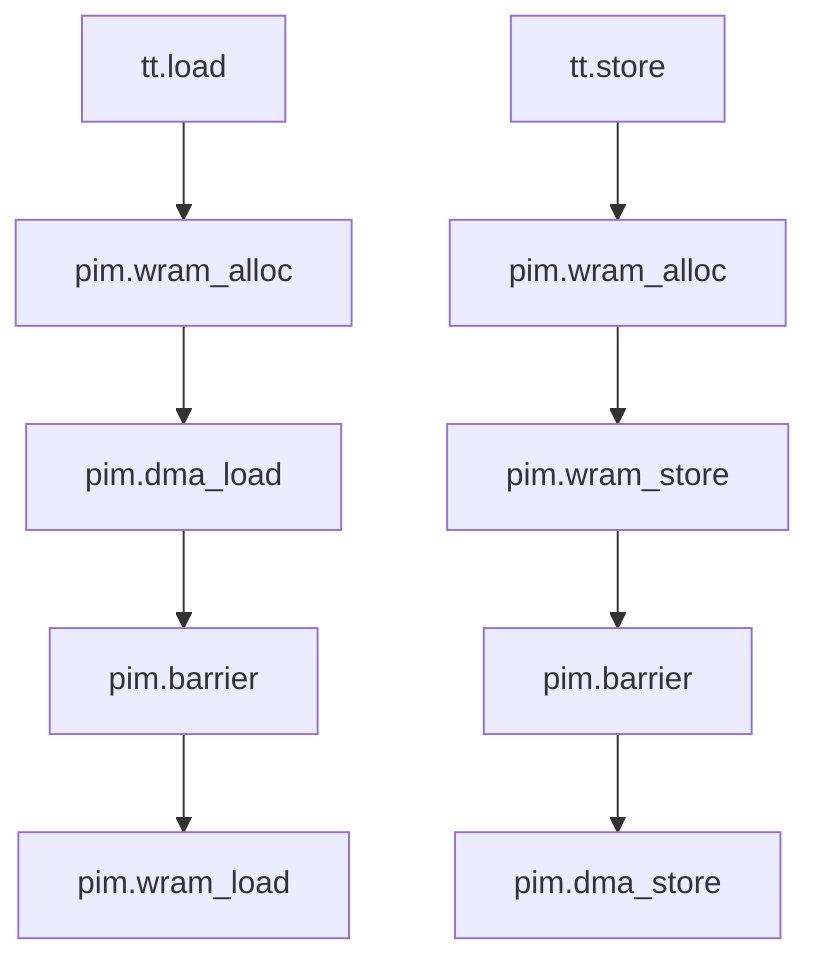

### 9.2 `tt.load` 改写逻辑

函数：`rewriteLoad()`

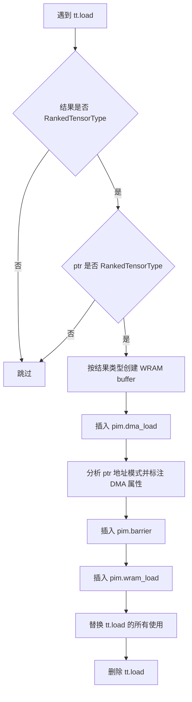

生成形式：

```mlir
%buf = pim.wram_alloc : !pim.memdesc<64xf32, #pim.wram>
pim.dma_load %ptrs -> %buf : tensor<64x!tt.ptr<f32>> -> !pim.memdesc<64xf32, #pim.wram>
pim.barrier
%v = pim.wram_load %buf : !pim.memdesc<64xf32, #pim.wram> -> tensor<64xf32, #layout>
```

### 9.3 `tt.store` 改写逻辑

函数：`rewriteStore()`

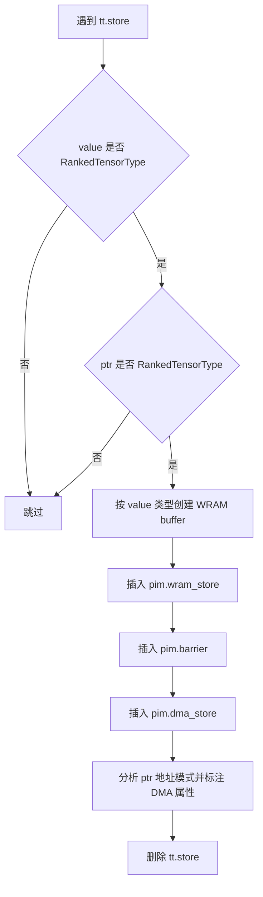

生成形式：

```mlir
%buf = pim.wram_alloc : !pim.memdesc<64xf32, #pim.wram>
pim.wram_store %v, %buf : tensor<64xf32, #layout> -> !pim.memdesc<64xf32, #pim.wram>
pim.barrier
pim.dma_store %buf -> %ptrs : !pim.memdesc<64xf32, #pim.wram> -> tensor<64x!tt.ptr<f32>>
```

### 9.4 WRAM 分配提升

函数：`getAllocInsertPoint()`、`createHoistedAlloc()`

WRAM buffer 不应该在循环里每次迭代都分配，因此 pass 会把 `pim.wram_alloc` 放到最外层循环之前。

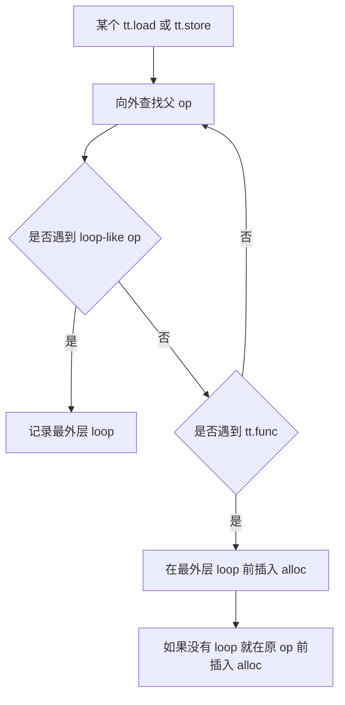

### 9.5 指针分析逻辑

pass 会尝试从 pointer tensor 里证明 DMA 可表达成“基地址 + 步长”。

输出属性：


| 属性             | 含义                                 |
| ---------------- | ------------------------------------ |
| `contiguous_dim` | 哪个维度地址连续或固定步长           |
| `elem_stride`    | 该维度每前进一步，地址增加多少个元素 |
| `base_arg`       | 基地址可追溯到第几个`tt.func` 参数   |

如果分析失败，则不写这些属性。属性缺失不是默认连续，而是“当前没有证明”。

分析入口：


| 函数                 | 作用                                                 |
| -------------------- | ---------------------------------------------------- |
| `analyzePointers()`  | 分析 pointer tensor 是否来自`tt.addptr`              |
| `traceBaseArg()`     | 从`tt.addptr`、`tt.splat`、`tt.bitcast` 反查函数参数 |
| `analyzeOffsets()`   | 分析 offset tensor 的每维步长                        |
| `analyzeAdd()`       | 合并加法两侧的维度步长                               |
| `matchConstantInt()` | 识别常量整数，包括 splat 常量                        |
| `annotate()`         | 把分析结果写到 DMA 算子属性上                        |

当前能识别的 offset 形态：


| 形态                 | 处理                                      |
| -------------------- | ----------------------------------------- |
| 常量                 | 所有维度步长为 0                          |
| `pim.convert_layout` | 忽略布局转换，继续分析源值                |
| `tt.make_range`      | 认为最后一维单位步长                      |
| `tt.splat`           | 认为均匀，不随维度变化                    |
| `tt.expand_dims`     | 插入一个步长为 0 的维度                   |
| `tt.broadcast`       | 被 broadcast 的维度步长为 0，其它维度保留 |
| `arith.addi`         | 合并左右两边维度步长                      |
| `arith.muli` 乘常量  | 按常量缩放步长                            |

分析示例：

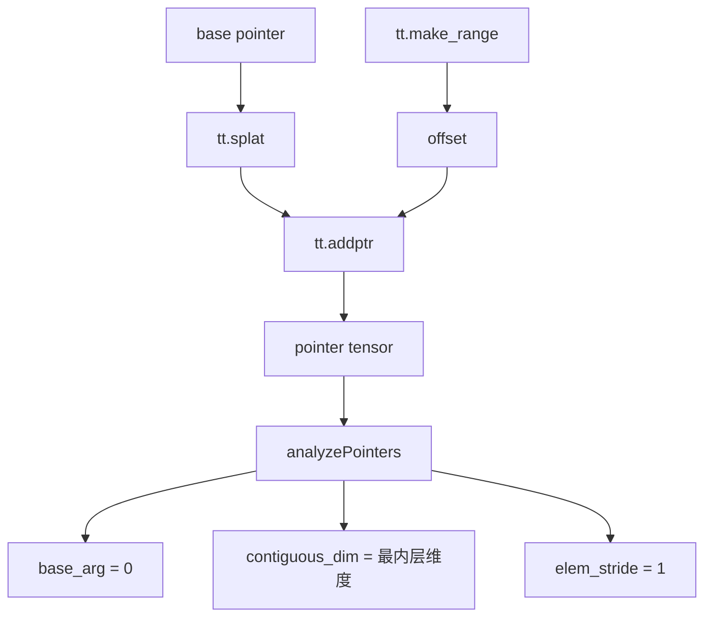

### 9.6 WRAM 用量统计

`pim-explicit-dma` 最后会遍历所有 `pim.wram_alloc`，累加静态可知的字节数，并写入：

```mlir
"pim.wram-bytes-used" = 12288 : i32
```

如果超过 `pim.wram-bytes`，当前只发 warning，不会自动重新切 tile。

## 10. Python 和 NVIDIA 后端接入

### 10.1 Python IR 绑定

文件：`python/src/ir.cc`

改动：


| 改动                                           | 作用                                           |
| ---------------------------------------------- | ---------------------------------------------- |
| include`triton/Dialect/TritonPIM/IR/Dialect.h` | 让 C++ 绑定认识 TritonPIM 方言                 |
| `load_dialects()` 注册 `TritonPIMDialect`      | Python 侧构造或解析 PIM IR 时能加载方言        |
| `ModuleOp.clone()` 绑定                        | PIM sidecar 可以克隆 TTIR，避免破坏 GPU 主路径 |

### 10.2 Python pass 绑定

文件：`python/src/passes.cc`

新增子模块：

```python
passes.pim.add_convert_to_pim(...)
passes.pim.add_explicit_dma(...)
```

对应 C++：


| Python 函数                                                                               | C++ pass                              |
| ----------------------------------------------------------------------------------------- | ------------------------------------- |
| `add_convert_to_pim(pm, target, num_dpus, num_tasklets, wram_bytes, enable_source_remat)` | `createConvertTritonToTritonPIM(...)` |
| `add_explicit_dma(pm)`                                                                    | `pim::createTritonPIMExplicitDMA()`   |

### 10.3 PIM sidecar

文件：`python/triton/backends/pim_sidecar.py`

这个文件当前存在于工作区，但因为 `.gitignore` 规则被忽略，普通 `git status` 不显示。

它的逻辑：

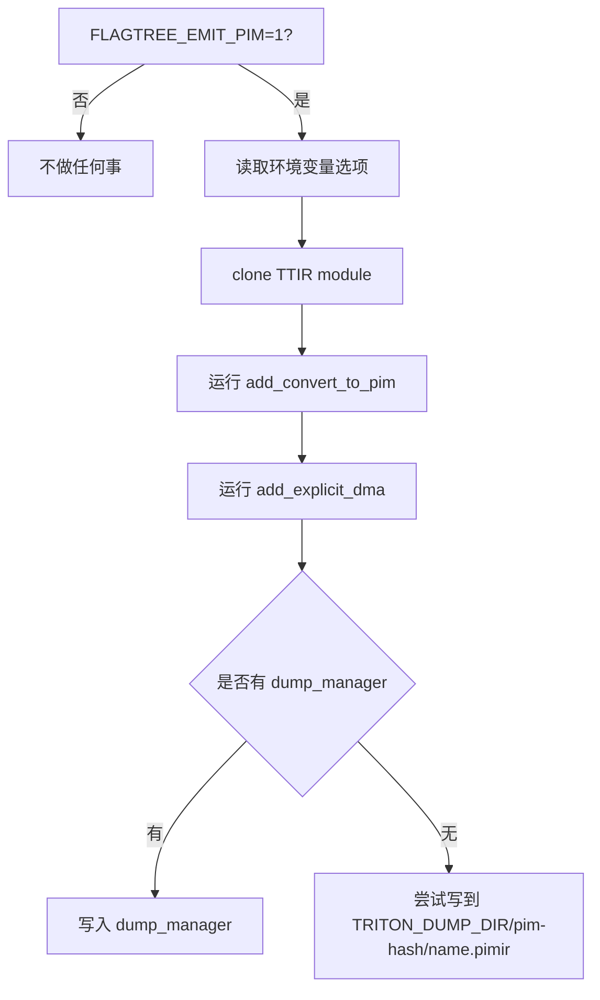

环境变量：


| 变量                        | 默认值   | 含义                 |
| --------------------------- | -------- | -------------------- |
| `FLAGTREE_EMIT_PIM`         | `0`      | 是否启用 PIM IR 输出 |
| `FLAGTREE_PIM_TARGET`       | `pim:v1` | PIM target           |
| `FLAGTREE_PIM_NUM_DPUS`     | `1`      | DPU 数               |
| `FLAGTREE_PIM_NUM_TASKLETS` | `16`     | tasklet 数           |
| `FLAGTREE_PIM_WRAM_BYTES`   | `65536`  | WRAM 预算            |

### 10.4 NVIDIA 编译入口

文件：`third_party/nvidia/backend/compiler.py`

在 `CUDABackend.make_ttir()` 的末尾新增：

```python
if pim_sidecar.is_enabled():
    pim_sidecar.emit_pim_ir(mod, metadata)
```

含义：


| 点                | 说明                                             |
| ----------------- | ------------------------------------------------ |
| 插入位置          | TTIR 优化完成之后、进入 TTGIR 之前               |
| 为什么在这里      | PIM 需要从 TTIR 分叉，不能插进 GPU 的线性 stage  |
| 是否影响 GPU 编译 | 按设计不影响，因为 sidecar 会 clone module       |
| 失败处理          | sidecar 内部捕获异常并 warning，不应该阻断主编译 |

## 11. 构建系统接入

### 11.1 新增 include 构建入口


| 文件                                       | 改动                                  |
| ------------------------------------------ | ------------------------------------- |
| `include/triton/Dialect/CMakeLists.txt`    | `add_subdirectory(TritonPIM)`         |
| `include/triton/Conversion/CMakeLists.txt` | `add_subdirectory(TritonToTritonPIM)` |

### 11.2 新增 lib 构建入口


| 文件                            | 改动                                  |
| ------------------------------- | ------------------------------------- |
| `lib/Dialect/CMakeLists.txt`    | `add_subdirectory(TritonPIM)`         |
| `lib/Conversion/CMakeLists.txt` | `add_subdirectory(TritonToTritonPIM)` |

### 11.3 新增库


| 库                    | 源文件                                                 | 依赖                                              |
| --------------------- | ------------------------------------------------------ | ------------------------------------------------- |
| `TritonPIMIR`         | `Dialect.cpp`、`Ops.cpp`、`Types.cpp`                  | `TritonIR`                                        |
| `TritonPIMTransforms` | `ExplicitDMA.cpp`                                      | `TritonIR`、`TritonPIMIR`、MLIR pass/transform 库 |
| `TritonToTritonPIM`   | `TritonPIMConversion.cpp`、`TritonToTritonPIMPass.cpp` | `TritonIR`、`TritonPIMIR`、MLIR pass/transform 库 |

### 11.4 TableGen 产物


| TableGen 文件    | 生成内容            |
| ---------------- | ------------------- |
| `PIMDialect.td`  | 方言声明和定义      |
| `PIMOps.td`      | 算子声明和定义      |
| `PIMTypes.td`    | 类型声明和定义      |
| `PIMAttrDefs.td` | 属性和枚举声明定义  |
| `Passes.td`      | pass 声明和注册代码 |

## 12. triton-opt 注册

文件：`bin/RegisterTritonDialects.h`

新增：


| 注册项                                                | 作用                                         |
| ----------------------------------------------------- | -------------------------------------------- |
| include`triton/Conversion/TritonToTritonPIM/Passes.h` | 引入转换 pass 声明                           |
| include`triton/Dialect/TritonPIM/Transforms/Passes.h` | 引入 PIM transforms pass 声明                |
| `registerConvertTritonToTritonPIMPass()`              | 让`triton-opt` 认识 `-convert-triton-to-pim` |
| `pim::registerTritonPIMPasses()`                      | 让`triton-opt` 认识 `-pim-explicit-dma`      |
| 注册`TritonPIMDialect`                                | 让`triton-opt` 能解析和打印 `pim` 方言       |

测试里的典型命令：

```bash
triton-opt input.mlir -convert-triton-to-pim='target=pim:v1 num-tasklets=16 wram-bytes=65536'
triton-opt input.mlir -convert-triton-to-pim='target=pim:v1 num-tasklets=16 wram-bytes=65536' -pim-explicit-dma
```

## 13. 测试覆盖

### 13.1 `test/Conversion/triton_to_pim.mlir`

覆盖：


| 用例               | 验证内容                                                              |
| ------------------ | --------------------------------------------------------------------- |
| `elementwise`      | module 上写入 PIM 属性；张量带 PIM encoding；`tt.load/store` 暂不改写 |
| `matmul_tile`      | `tt.dot` 保留；`scf.for` 的 iter_args 类型带布局                      |
| `shape_ops`        | `tt.trans`、`tt.reduce` 通过布局推导接口生成结果布局                  |
| `expand_broadcast` | `expand_dims` 和 `broadcast` 的布局转换                               |

### 13.2 `test/Dialect/TritonPIM/ops.mlir`

覆盖：


| 用例                    | 验证内容                                     |
| ----------------------- | -------------------------------------------- |
| `hierarchy_queries`     | `pim.tasklet_id`、`pim.dpu_id` 打印解析      |
| `wram_alloc_and_access` | WRAM 分配、读写、barrier                     |
| `alloc_variants`        | alignment 属性和 immutable memdesc           |
| `dma_plain`             | 普通 DMA load/store                          |
| `dma_masked`            | 带 mask、fill、DMA 地址属性的 load/store     |
| `relayout`              | `pim.convert_layout` 和 `#pim.tasklet_tiled` |
| `mram_desc`             | `#pim.mram` memdesc                          |

### 13.3 `test/Dialect/TritonPIM/explicit_dma.mlir`

覆盖：


| 用例                        | 验证内容                                                        |
| --------------------------- | --------------------------------------------------------------- |
| `single_load`               | `tt.load` 改成 `wram_alloc + dma_load + barrier + wram_load`    |
| `single_store`              | `tt.store` 改成 `wram_alloc + wram_store + barrier + dma_store` |
| `proven_contiguous`         | 一维连续访问能标注`base_arg`、`contiguous_dim`、`elem_stride`   |
| `proven_2d`                 | 二维 row-major tile 能识别最后一维连续                          |
| `unproven_gather`           | gather 访问不能证明连续时不写 DMA 布局属性                      |
| `alloc_hoisted_out_of_loop` | WRAM 分配提升到循环外                                           |
| `wram_usage_reported`       | 统计`pim.wram-bytes-used`                                       |
| `masked_load`               | mask 和 fill value 保留到`pim.dma_load`                         |

## 14. 端到端理解示例

输入 TTIR 简化形式：

```mlir
%ptrs = tt.addptr %base, %offset
%a = tt.load %ptrs : tensor<64x!tt.ptr<f32>>
%b = arith.addf %a, %a : tensor<64xf32>
tt.store %ptrs, %b : tensor<64x!tt.ptr<f32>>
```

经过 `convert-triton-to-pim` 后：

```mlir
%ptrs = tt.addptr ... : tensor<64x!tt.ptr<f32>, #pim_layout>, tensor<64xi32, #pim_layout>
%a = tt.load %ptrs : tensor<64x!tt.ptr<f32>, #pim_layout>
%b = arith.addf %a, %a : tensor<64xf32, #pim_layout>
tt.store %ptrs, %b : tensor<64x!tt.ptr<f32>, #pim_layout>
```

再经过 `pim-explicit-dma` 后：

```mlir
%load_buf = pim.wram_alloc : !pim.memdesc<64xf32, #pim.wram>
pim.dma_load %ptrs -> %load_buf {contiguous_dim = 0 : i64, elem_stride = 1 : i64}
pim.barrier
%a = pim.wram_load %load_buf : !pim.memdesc<64xf32, #pim.wram> -> tensor<64xf32, #pim_layout>

%b = arith.addf %a, %a : tensor<64xf32, #pim_layout>

%store_buf = pim.wram_alloc : !pim.memdesc<64xf32, #pim.wram>
pim.wram_store %b, %store_buf : tensor<64xf32, #pim_layout> -> !pim.memdesc<64xf32, #pim.wram>
pim.barrier
pim.dma_store %store_buf -> %ptrs {contiguous_dim = 0 : i64, elem_stride = 1 : i64}
```

## 15. 当前实现存在的问题

### 15.1 PIM sidecar 文件被忽略，提交风险高

`third_party/nvidia/backend/compiler.py` 直接导入：

```python
from triton.backends import pim_sidecar
```

但 `python/triton/backends/pim_sidecar.py` 当前被 `.gitignore` 的 `python/triton/backends/*` 规则忽略。也就是说：


| 风险                                             | 影响                   |
| ------------------------------------------------ | ---------------------- |
| 普通`git status` 看不到该文件                    | 容易漏提交             |
| 如果只提交`compiler.py`，不提交 `pim_sidecar.py` | Python 导入可能失败    |
| 这个目录本来像是后端拷贝产物目录                 | 需要确认源码应放在哪里 |

建议：明确 `pim_sidecar.py` 的归属。如果要作为源码提交，要么调整 `.gitignore` 白名单，要么放到未忽略的后端源码目录。

### 15.2 当前还不是完整 PIM 后端

当前输出停在 PIM MLIR 文本：


还缺少：


| 缺失项                       | 说明                                               |
| ---------------------------- | -------------------------------------------------- |
| PIM IR 到低层 IR 的 lowering | 还没有把`pim.*` 算子变成真实设备指令或运行时代码   |
| 运行时集成                   | 没有 DPU 分配、MRAM 数据布局、host 到 DPU 数据搬运 |
| 目标设备 ABI                 | `pim:v1` 只是目标字符串，还没有明确 ABI            |
| 性能模型闭环                 | 有属性和 WRAM 用量统计，但没有真正调度和切 tile    |

### 15.3 WRAM 超预算只 warning，不会自动处理

`pim-explicit-dma` 会统计 `pim.wram-bytes-used`，超过预算时只发 warning：


| 当前行为                 | 问题                           |
| ------------------------ | ------------------------------ |
| 统计 staging buffer 总量 | 可以发现超预算                 |
| 超预算只 warning         | IR 仍然可能不可执行            |
| 不切 tile                | 大 tile 需要后续 pass 重构循环 |

后续需要一个 tile splitting 或 WRAM planning pass。

### 15.4 DMA 指针分析故意很窄

当前只能识别常见的 `splat + make_range + expand_dims + broadcast + add/mul` 模式。

不能很好处理：


| 场景                      | 当前结果            |
| ------------------------- | ------------------- |
| gather/scatter 间接索引   | 不标注 DMA 布局属性 |
| 复杂指针表达式            | 分析失败            |
| 多个变化项落到同一维度    | 分析失败            |
| 负 stride 或更复杂 stride | 当前基本不支持      |

这是保守设计，不会乱猜，但会限制后端利用 DMA 的能力。

### 15.5 `tt.load/store` 的 scalar 情况被跳过

`rewriteLoad()` 和 `rewriteStore()` 对非 `RankedTensorType` 会直接跳过。


| 情况              | 当前行为              |
| ----------------- | --------------------- |
| tensor load/store | 改写成 DMA            |
| scalar load/store | 保留原`tt.load/store` |

如果目标 PIM IR 不允许任何隐式全局访问，后续需要处理 scalar 访问。

### 15.6 部分 Triton 算子只是保留，没有 PIM 语义 lowering

`convert-triton-to-pim` 会保留很多 TTIR 算子，例如：


| 算子                        | 当前状态                     |
| --------------------------- | ---------------------------- |
| `tt.dot`                    | 保留，不做 PIM 专用 lowering |
| `tt.reduce`                 | 保留结构，布局推导           |
| `tt.scan`                   | 保留结构，布局推导           |
| `tt.atomic_*`               | 类型转换后保留               |
| `tt.extern_elementwise`     | 类型转换后保留               |
| `tt.histogram`、`tt.gather` | 类型转换后保留               |

这对中间表示探索是合理的，但离可执行 PIM 代码还有距离。

### 15.7 barrier 插入策略比较粗

当前每个 DMA load 后插一个 barrier，每个 WRAM store 后插一个 barrier。


| 好处               | 问题                    |
| ------------------ | ----------------------- |
| 简单、安全         | barrier 可能过多        |
| 容易验证正确性     | 后续性能可能差          |
| 不依赖复杂依赖分析 | 不能合并多个 DMA 的同步 |

后续可以做依赖分析和 barrier 合并。

### 15.8 WRAM buffer 复用还不够

当前每个 load/store 都创建一个 WRAM buffer，并提升到循环外。


| 当前行为                        | 潜在问题                           |
| ------------------------------- | ---------------------------------- |
| 每个内存访问一个 staging buffer | WRAM 占用可能偏大                  |
| 提升到循环外                    | 生命周期变长                       |
| 不做 buffer reuse               | 多个互斥生命周期的 buffer 无法共享 |

后续需要 WRAM buffer reuse 或 memory planning。

### 15.9 `num-dpus` 当前基本没有真正参与 kernel 划分

`#pim.tasklet_tiled` 支持 `dpusPerDevice` 字段，但默认转换中注释明确说明 kernel 当前按单 DPU 构造，`numDpus` 主要记录到 module 属性。


| 字段            | 当前状态     |
| --------------- | ------------ |
| `pim.num-dpus`  | 记录硬件参数 |
| `dpusPerDevice` | 默认全 1     |
| 跨 DPU sharding | 未实现       |

后续如果要多 DPU 并行，需要图级或 kernel 级 sharding 设计。

### 15.10 生成文件和临时文件混在工作区

当前工作区有：


| 文件或目录                                                            | 问题         |
| --------------------------------------------------------------------- | ------------ |
| `python/flagtree.egg-info/`                                           | 像打包生成物 |
| `2026-08-16-092127-local-command-caveatcaveat-the-messages-below.txt` | 像临时日志   |

这些不属于核心实现，建议清理或加入忽略规则。

## 16. 建议的后续工作顺序


| 优先级 | 工作                              | 原因                                               |
| ------ | --------------------------------- | -------------------------------------------------- |
| 高     | 解决`pim_sidecar.py` 被忽略的问题 | 否则提交后可能直接导入失败                         |
| 高     | 跑通 C++ 构建和 MLIR lit 测试     | 当前新增方言和 pass 依赖 TableGen 与链接，必须验证 |
| 高     | 明确 PIM IR 的输出位置和使用方式  | 让用户知道`.pimir` 从哪里拿                        |
| 中     | 处理 scalar`tt.load/store`        | 避免 PIM IR 中残留隐式内存访问                     |
| 中     | WRAM 超预算切 tile                | 从“能发现问题”走向“能生成可执行计划”           |
| 中     | buffer reuse 和 barrier 合并      | 改善 WRAM 占用和性能                               |
| 中     | 扩展指针分析                      | 提高 DMA 可用范围                                  |
| 低     | 多 DPU sharding                   | 需要更上层调度设计支撑                             |
| 低     | PIM IR 到真实后端 lowering        | 这是完整后端的大工程                               |

## 17. 快速阅读代码路线

如果只想高效理解代码，建议按这个顺序读：

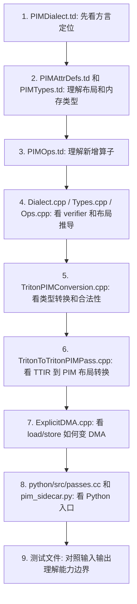

最核心的三个文件：


| 文件                                                         | 为什么核心                         |
| ------------------------------------------------------------ | ---------------------------------- |
| `include/triton/Dialect/TritonPIM/IR/PIMOps.td`              | 定义了 PIM IR 长什么样             |
| `lib/Conversion/TritonToTritonPIM/TritonToTritonPIMPass.cpp` | 定义 TTIR 如何变成带 PIM 布局的 IR |
| `lib/Dialect/TritonPIM/Transforms/ExplicitDMA.cpp`           | 定义隐式内存访问如何变成显式 DMA   |
